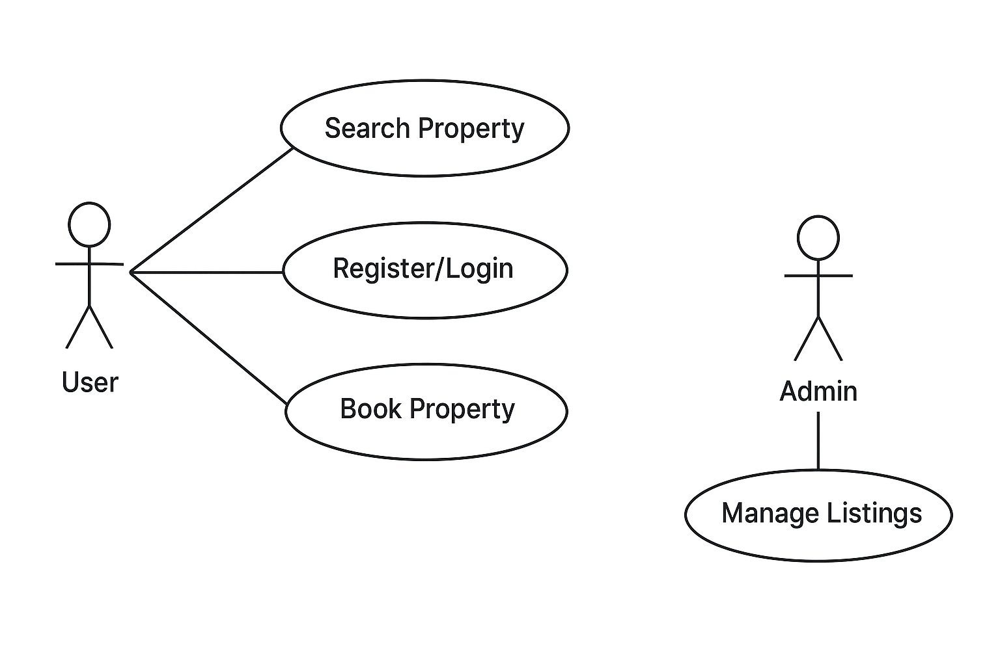

#Requirement Analysis in Software Development

Introduction:
This repository is dedicated to documenting the Requirement Analysis phase of a software development project. It focuses on identifying, gathering, and analyzing the requirements for a booking management system. The goal is to create a clear and structured blueprint that guides development, aligns with stakeholder needs, and ensures the success of the project.
## What is Requirement Analysis?

Requirement Analysis is the process of collecting, evaluating, and defining the needs and expectations of stakeholders for a software system. It ensures that everyone involved—developers, designers, and users—has a clear understanding of what the system should do before any code is written.

Importance in the SDLC:
- Clarity: Provides a clear vision of project goals and features.
- Risk Reduction: Identifies potential issues early to prevent costly mistakes.
- Guidance: Sets the foundation for design, development, and testing.
- Quality Assurance: Ensures the final software meets user expectations and business requirements.
  
#Why is Requirement Analysis Important?

Requirement Analysis is critical in the Software Development Life Cycle (SDLC) because it ensures the project is well-planned, reduces errors, and delivers value to users. Key reasons include:

Clarifies Project Goals:
Helps all stakeholders understand what the system must achieve, ensuring everyone is aligned.

Reduces Development Risks:
Identifies potential issues early in the project, preventing costly mistakes during coding or testing.

Improves Quality and User Satisfaction:
Clear and well-defined requirements ensure that the final software meets business needs and user expectations.

#Key Activities in Requirement Analysis

The Requirement Analysis phase involves several key activities to ensure the project is well-defined and aligned with stakeholder needs:

Requirement Gathering:
Collecting information from stakeholders through interviews, surveys, workshops, and observation to understand their needs and expectations.

Requirement Elicitation:
Refining and exploring gathered requirements using techniques like brainstorming, prototyping, and use case analysis to clarify unclear or hidden requirements.

Requirement Documentation:
Creating detailed documents such as requirement specifications, user stories, and use cases to formally capture the requirements.

Requirement Analysis and Modeling:
Organizing and analyzing requirements to identify dependencies, conflicts, and priorities. Creating models or diagrams to visualize system structure and interactions.

Requirement Validation:
Reviewing requirements with stakeholders to ensure accuracy, completeness, and alignment with business objectives before moving to design and development.
#Types of Requirements
Functional Requirements

Functional requirements define what the system should do — the features and functions it must provide. Examples for a booking management system include:

Users can search for available properties.

Users can register and log in to the system.

Users can book a property and receive confirmation.

Admins can add, update, or remove property listings.

Non-functional Requirements

Non-functional requirements describe how the system should perform and define qualities such as usability, reliability, and performance. Examples include:

The system should load pages within 2 seconds.

The system must be secure, protecting user data.

The system should handle up to 1,000 concurrent users.

The interface should be user-friendly and responsive on mobile and desktop.

#Use Case Diagrams

A Use Case Diagram is a visual representation that shows how users (actors) interact with a system and the functions (use cases) the system provides. Use Case Diagrams help to:

Understand system requirements visually.

Identify all interactions between users and the system.

Clarify the scope of the system for stakeholders and developers.

Example Use Case Diagram for Booking Management System:

Actors: User, Admin

Use Cases:

Search Property

Register / Login

Book Property

Manage Listings (Admin)

Diagram:

